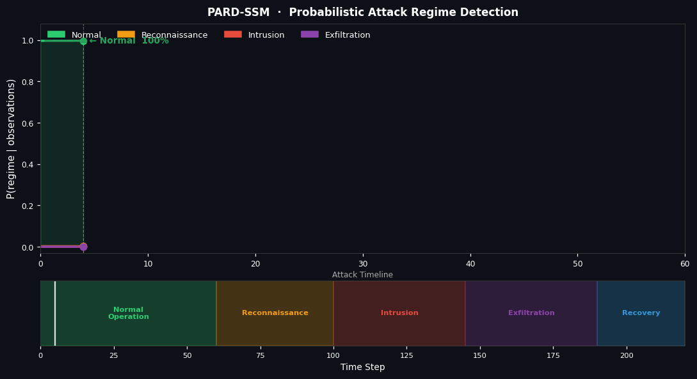

# Probabilistic Attack Regime Detection in Network Traffic using Switching State-Space Models


A probabilistic framework for **early detection of cyber-attack stages** in network telemetry using **Switching State-Space Models (SSSM)**.

The system models network traffic as a **temporal stochastic process** and infers hidden regimes such as reconnaissance, intrusion attempts, and data exfiltration. By tracking regime transitions over time, the model can identify attacks **before they fully manifest**.

---

# Project Overview

Enterprise networks generate continuous streams of telemetry such as:

* packet counts
* connection rates
* authentication events
* protocol distributions
* flow statistics

Most intrusion detection systems operate using:

* static thresholds
* rule-based alerts
* supervised classification

These approaches often detect attacks **only after clear anomalies appear**.

This project instead models network behavior as a **dynamic probabilistic system** where the true network condition is hidden and must be inferred from noisy observations.

The objective is to estimate:

* hidden operational regimes of the network
* transition probabilities between regimes
* early indicators of attack progression

---

# Attack Regime Modeling

Many cyber attacks follow multi-stage progression:

1. **Normal operation**
2. **Reconnaissance / scanning**
3. **Initial intrusion attempts**
4. **Privilege escalation**
5. **Lateral movement**
6. **Data exfiltration**

Rather than detecting isolated events, this project models **attack progression as regime transitions in a temporal process**.

---

# Model Architecture

The system uses a **Switching State-Space Model (SSSM)**.

```
Network Telemetry
      │
      ▼
Feature Extraction
      │
      ▼
Observation Vector y_t
      │
      ▼
Switching State-Space Model
      │
 ┌────┴─────────────┐
 │ Hidden State x_t │
 │ Attack Regime s_t│
 └────┬─────────────┘
      │
      ▼
Inference Engine
(Kalman / Variational)
      │
      ▼
Regime Probabilities
      │
      ▼
Early Attack Detection
```

---

# Mathematical Formulation

The system is modeled as a **latent dynamical process**.

### State Dynamics

[
x_t = A_{s_t} x_{t-1} + w_t
]

Where:

* (x_t) = hidden network state
* (A_{s_t}) = regime-specific transition matrix
* (w_t) = process noise

---

### Observation Model

[
y_t = C_{s_t} x_t + v_t
]

Where:

* (y_t) = observed network telemetry
* (C_{s_t}) = observation matrix
* (v_t) = measurement noise

---

### Regime Transition

[
P(s_t | s_{t-1})
]

Modeled as a **Markov transition matrix**.

Each regime corresponds to an attack stage such as:

* normal
* scanning
* intrusion
* exfiltration

---

# Inference Methods

Hidden states and regime probabilities are estimated using:

* Kalman Filter
* Extended Kalman Filter (EKF)
* Unscented Kalman Filter (UKF)
* Variational Switching Kalman Filter

These methods estimate:

* posterior state distribution
* probability of each regime
* regime transition timing

---

# Datasets

The system is evaluated using public intrusion detection datasets.

### CICIDS2017

A widely used dataset containing modern attack scenarios.

Includes attacks such as:

* brute force
* DoS
* infiltration
* port scanning
* botnet activity

---

### UNSW-NB15

A benchmark dataset with modern attack patterns.

Features include:

* packet statistics
* flow metadata
* protocol behavior

---

# Repository Structure

```
probabilistic-attack-regime-detection
│
├── README.md
├── LICENSE
├── requirements.txt
│
├── data
│   ├── raw
│   └── processed
│
├── src
│   │
│   ├── models
│   │   ├── linear_ssm.py
│   │   ├── nonlinear_ssm.py
│   │   └── switching_ssm.py
│   │
│   ├── inference
│   │   ├── kalman_filter.py
│   │   ├── ekf.py
│   │   ├── ukf.py
│   │   └── variational_switching_filter.py
│   │
│   ├── data_processing
│   │   ├── dataset_loader.py
│   │   └── feature_engineering.py
│   │
│   └── utils
│       └── visualization.py
│
├── notebooks
│   ├── dataset_exploration.ipynb
│   └── regime_detection_demo.ipynb
│
└── experiments
    └── evaluation_metrics.py
```

---

# Installation

Clone the repository.

```bash
git clone https://github.com/prakulhiremath/PARD-in-Network-Traffic-using-Switching-State-Space-Models-.git

cd probabilistic-attack-regime-detection
```

Install dependencies.

```bash
pip install -r requirements.txt
```

---

# Running the Model

### Prepare datasets

Download datasets and place them in:

```
data/raw/
```

Preprocess data.

```
python src/data_processing/dataset_loader.py
```

---

### Train the switching model

```
python src/models/switching_ssm.py
```

Outputs include:

* regime probabilities
* hidden state estimates
* predicted attack stage

---

### Visualization

```
python src/utils/visualization.py
```

Generates plots for:

* regime transition timeline
* attack stage probabilities
* state trajectory

---

# Evaluation Metrics

Performance is evaluated using:

* prediction error
* log likelihood
* regime classification accuracy
* detection lead time
* confusion matrix

---

# Future Work

Possible extensions include:

* streaming inference for real-time monitoring
* integration with SIEM platforms
* neural state-space models
* unsupervised discovery of new attack regimes
* deployment for enterprise network telemetry

---

# Team

Prakul Sunil Hiremath
Peerahamad Bagawan
Sahil Bekane
Hemanth B. K.
---

# Regime Detection Visualization

Example visualization showing how the model tracks **probabilities of hidden attack regimes over time**.
Each line represents the inferred probability of a regime.

* Normal traffic
* Scanning / reconnaissance
* Intrusion attempts
* Data exfiltration



The model continuously updates regime probabilities as new telemetry arrives, allowing detection of attack progression before the attack fully develops.

# Citation

If you use this repository in research, please cite it.

```
@software{hiremath2026attackregime,
  author = {Hiremath, Prakul Sunil and Bagawan, Peerahamad and Bekane, Sahil and Hemanth, B. K.},
  title = {Probabilistic Attack Regime Detection in Network Traffic using Switching State-Space Models},
  year = {2026},
  url = {https://github.com/yourusername/probabilistic-attack-regime-detection},
}
```

---

# Acknowledgment

This work builds on concepts from:

* state-space modeling
* probabilistic inference
* intrusion detection research
